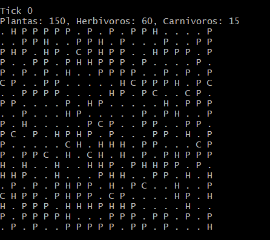
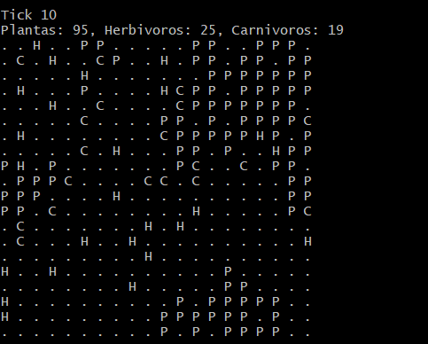
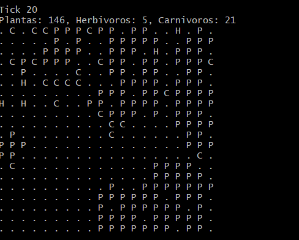

#  Simulación de Ecosistema con OpenMP

**Universidad del Valle de Guatemala**  
*Facultad de Ingeniería - Computación Paralela y Distribuida*  

---

## Descripción
Simulación paralelizada con OpenMP de un ecosistema con tres especies:  
- **Plantas (P)**: 

    Ocupan una celda fija y no se mueven.

    Reproducción: En cada tick, tienen una probabilidad definida (PLANT_REPRODUCTION_RATE) de generar una nueva planta en una celda adyacente vacía.

    Muerte por vejez: Si superan una edad máxima (PLANT_MAX_AGE), mueren y dejan su celda vacía.

    Muerte por falta de espacio: Si están completamente rodeadas por otras plantas o animales y no hay celdas vacías adyacentes, mueren.

    Consumo: Son eliminadas inmediatamente si un herbívoro se desplaza a su celda para alimentarse.
- **Herbívoros (H)**: 

    Alimentación: Buscan plantas en las 8 celdas adyacentes. Si encuentran una, se mueven hacia ella, la consumen y ganan energía (HERB_ENERGY_GAIN).

    Movimiento aleatorio: Si no encuentran comida, intentan moverse aleatoriamente a una celda vacía con cierta probabilidad (MOVEMENT_PROBABILITY).

    Energía y hambre: Pierden energía cada tick sin comer; si pasan más de MAX_NO_FOOD_TICKS sin alimentarse o su energía llega a 0, mueren.

    Reproducción: Si tienen energía suficiente (REPRODUCTION_ENERGY_THRESHOLD), intentan reproducirse en una celda vacía adyacente, transfiriendo parte de su energía a la cría.
- **Carnívoros (C)**:

    Caza: Buscan herbívoros en las 8 celdas adyacentes. Si encuentran uno, se mueven hacia él, lo eliminan y ganan energía (CARN_ENERGY_GAIN).

    Movimiento aleatorio: Si no encuentran presas, pueden desplazarse aleatoriamente a una celda vacía con probabilidad MOVEMENT_PROBABILITY.

    Energía y hambre: Pierden energía cada tick sin comer; si pasan más de MAX_NO_FOOD_TICKS sin alimentarse o su energía llega a 0, mueren.

    Reproducción: Si superan el umbral de energía (REPRODUCTION_ENERGY_THRESHOLD), intentan reproducirse en una celda adyacente vacía.

---

## 🛠 Requisitos
| Componente       | Versión/Detalle          |
|------------------|--------------------------|
| Sistema Operativo| Linux (recomendado)      |
| Compilador       | GCC con soporte OpenMP   |
| Bibliotecas      | `stdio.h`, `stdlib.h`, `time.h`, `omp.h` |

---

## ⚙️ Compilación y Ejecución
```bash
# Compilar con OpenMP
gcc -fopenmp ecosistema.c -o ecosistema

# Ejecutar
./ecosistema
```

### Paralelización con OpenMP
Estrategias de Paralelización Implementadas

Paralelización de Loops:
```bash
pragma omp parallel for collapse(2)
```
Se paraleliza el procesamiento de la cuadrícula usando collapse(2) para manejar ambas dimensiones. Acelera procesos que afectan muchas celdas (ej. inicializar la grilla, copiar grid a next_grid, actualizar especies).

Secciones Críticas:
```bash
pragma omp critical
```
Protege las escrituras concurrentes al grid para evitar condiciones de carrera.  Acciones como comer, reproducirse o moverse que podrían colisionar si dos hilos usan la misma celda simultáneamente.

Reductions:
```bash
pragma omp parallel for collapse(2) reduction(+:p,h,c)
```
Para contar poblaciones de forma eficiente sin conflictos.  Permite contar plantas, herbívoros y carnívoros en paralelo sin errores de concurrencia.

### Manejo de Condiciones de Carrera

Doble Buffer: Se utiliza grid y next_grid para separar lectura y escritura
Procesamiento por Especies: Se procesan plantas, herbívoros y carnívoros en fases separadas
Secciones Críticas: Protegen las operaciones de movimiento y alimentación

### Un poco de como se ven los outputs: 
Inicial: 



A la mitad:




AL final: 



#### Analizando los resultados pues es de esperarse que los herbivooros bajen demasiado ya que estos ganan solo 1 energia por cada planta que comen (al inicio comen bastantes plantas y por eso las plantas en un inicio bajan hasta 93) pero como necesitan minimo 2 de energia para reproducirse ya no suben, aparte y luego al haber muchas menos plantas ya los herbivoros no pueden comer, mas que tambien hay carnivoros tratando de comerse estos herbivoros, al pasar un rato y ya no haber tantans plantas algunos herbivoros no comen y siguen disminuyendo. Al disminuir herbivoros las plantas empiezan a subir y asi. Asi que es comportamiento esperado. 
